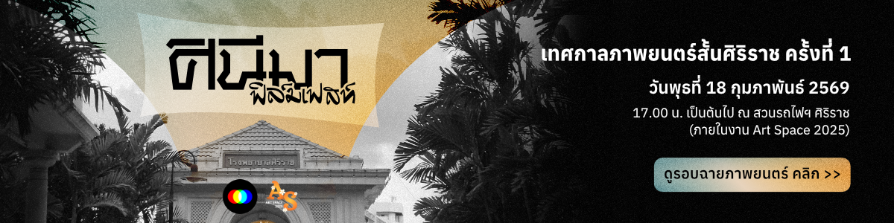

### Synopsis

---

หมอคณิต แพทย์อนาคตไกลที่กำลังจะประสบความสำเร็จในชีวิต ได้พบเจอกับ อนัน เพื่อนสนิทสมัยมัธยม ที่จะทำให้คณิตได้ทบทวนถึงอดีต ปัจจุบันและอนาคตของตน

### Cast

---

Surapass Charoenkitsereewong - คณิต  
Preeda Parhira - อนัน  
Buchita kerdlapmeesuk - นัด

### Crew

---

**Director**  
Nattawat Muangkaew

**Writer**  
Nattawat Muangkaew

**Producer**  
Nattawat Muangkaew

**Executive Producer**  
Mathee Ongsiriporn

**Director of photography**  
Kongphob Srinuch

**Editor**  
น้องโทยะ

**Assosiate Producer**  
Noprada Masuwan

**Music composer**  
Natapapon Apigulprapa

**Production Assistant**  
Waris Lappanathiti  
Kanokrada Sae-sow